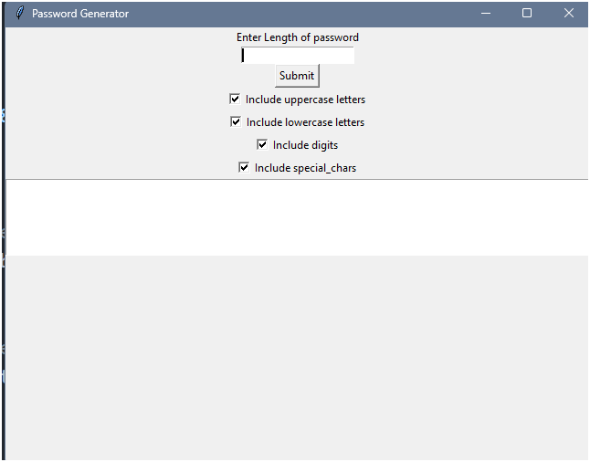

# Password Generator

A simple password generator built using Python and Tkinter.

# Features
Generates random passwords based on user preferences.
Allows customization of password length and character types (uppercase, lowercase, digits, special characters).
Provides a user-friendly interface.

# Requirements
Python 3.x
Tkinter (included in Python standard library)

# Installation
Clone this repository to your local machine:
git clone https://github.com/prateekraiger/Python_Project

Navigate to the project directory:
cd python-password-generator

Run the application:
python main.py

# Usage
Enter the desired password length.
Check the boxes for the character types you want to include.
Click the “Submit” button to generate a password.
The generated password will be displayed in the text widget below.

## Contributing

Contributions are welcome! If you have a Java project that you'd like to add, feel free to open a pull request.

See `contributing.md` for ways to get started.

Please adhere to this project's `code of conduct`.

## License
All projects in this repository are released under the MIT License. See `LICENSE` for more information.

[MIT](https://choosealicense.com/licenses/mit/)

